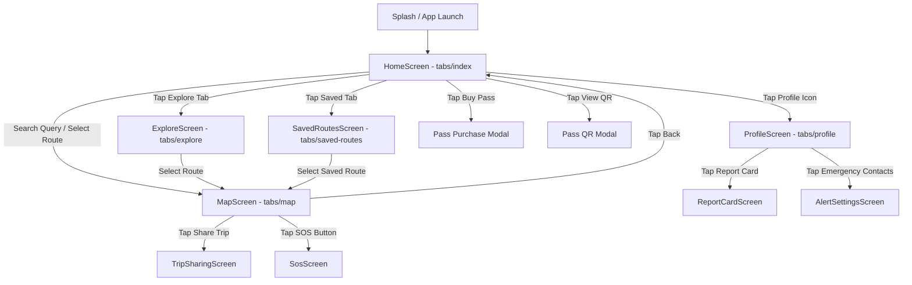
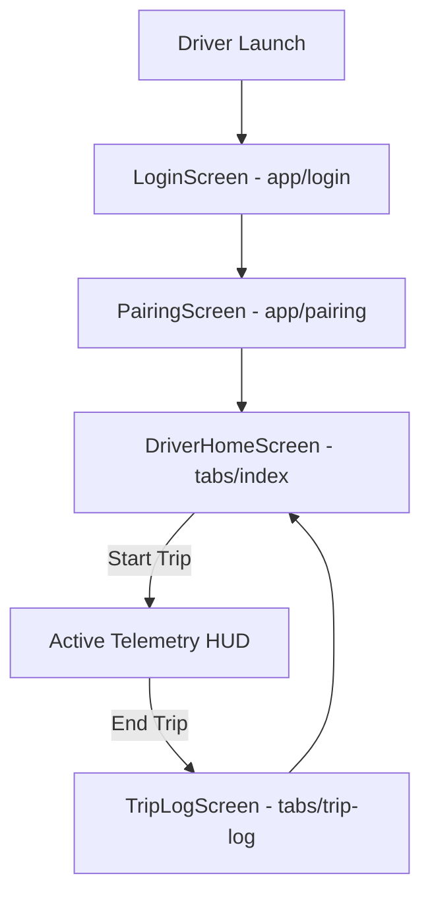
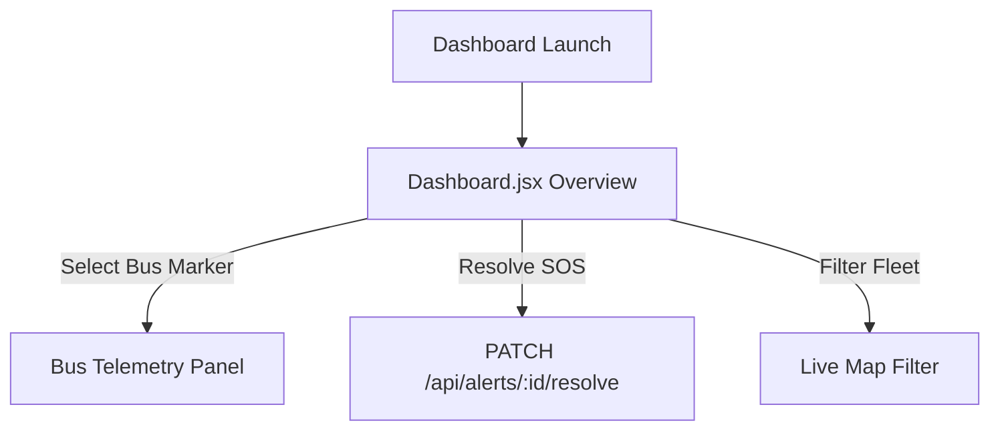

# NXTBus — Navigation Map & Hierarchy Specification

---

## 1. Commuter App Navigation Graph (`FRONTEND/commuter-app/`)

### Back Behavior Rules:
- Tapping **Back** (`←`) on `MapScreen` returns to the previous originating view (`HomeScreen`, `ExploreScreen`, or `SavedRoutesScreen`).
- Tapping **Back** on Modal dialogs (`PassModal`, `QrModal`) dismisses the overlay without resetting active tab context.

---

## 2. Driver App Navigation Graph (`FRONTEND/driver-app/`)

---

## 3. RTC Operations Dashboard Navigation Graph (`FRONTEND/rtc-dashboard/`)

